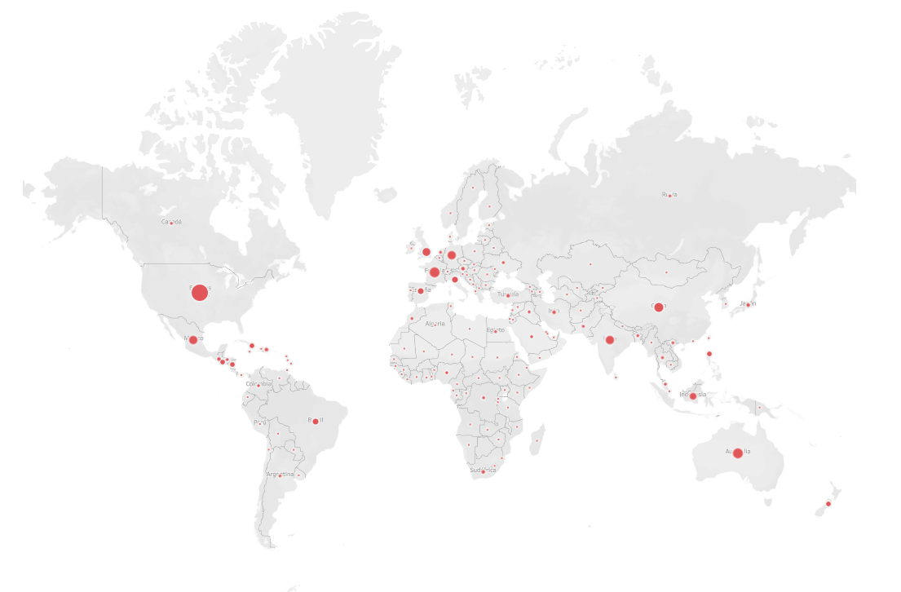
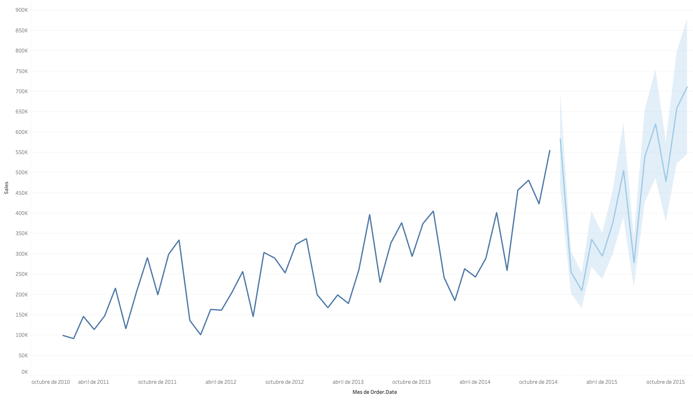
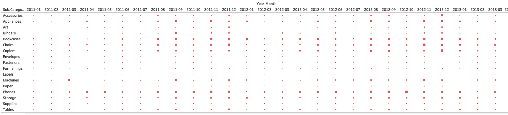
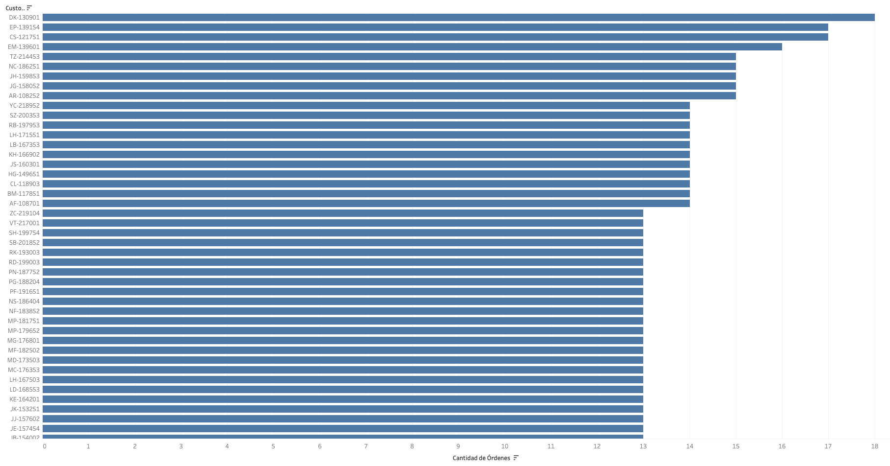
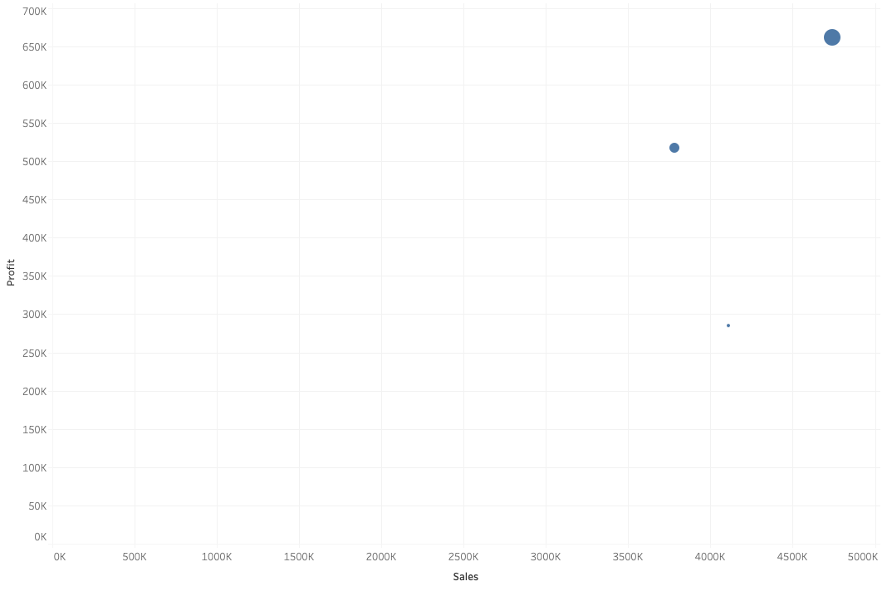
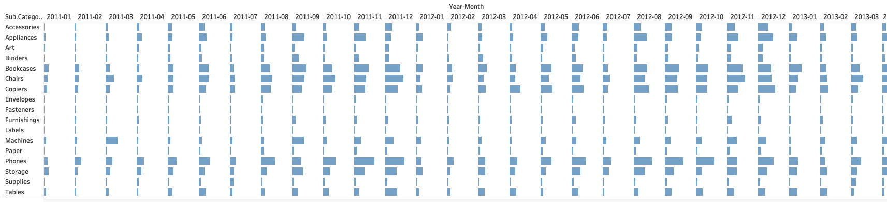

# Dashboard de BI: Tendencias de Ventas Globales

## Descripción del Proyecto
Este proyecto analiza datos masivos de ventas de e-commerce para crear visualizaciones interactivas que ayuden en la toma de decisiones empresariales. El proceso incluye limpieza de datos con Python y visualización con Tableau.

## Estructura del Proyecto
```
├── Datos/
│   ├── Raw/                    # Datos originales
│   │   └── global_super_store.csv
│   └── Cleaned/               # Datos procesados
│       └── global_super_store_clean.csv
├── Scripts/
│   └── clean_global_superstore.ipynb    # Script de limpieza
└── Tableau/
    └── ventas_globales.twb    # Dashboard de Tableau
```

## Objetivo
Analizar ventas por región, producto y tiempo, identificando clientes frecuentes y realizando forecasting.

## Proceso de Limpieza de Datos
El script `clean_global_superstore.ipynb` realiza las siguientes operaciones:

1. **Eliminación de Columnas Innecesarias**
   - Se eliminan columnas no relevantes para el análisis
   - Columnas eliminadas: "记录数", "Market2", "weeknum", "Customer.Name", "Row.ID"

2. **Manejo de Duplicados**
   - Eliminación de registros duplicados basados en Order.ID y Product.ID

3. **Creación de Características Temporales**
   - Conversión de fechas a formato datetime
   - Creación de columna "Year-Month" para análisis temporal

4. **Análisis de Clientes**
   - Cálculo de frecuencia de compra por cliente
   - Agregación de métrica "PurchaseFrequency"

5. **Formato de Datos Numéricos**
   - Conversión de formato decimal de punto (.) a coma (,)
   - Aplicado a todas las columnas numéricas

## Visualizaciones en Tableau
El dashboard incluye:
- Análisis de ventas por región

- Tendencias temporales y predicciones

- Mapa de calor de ventas por categoría y tiempo

- Análisis de clientes frecuentes

- Diagrama de correlación

- Ventas por producto y mes


## Herramientas Utilizadas
- **Python**
  - Pandas para manipulación de datos
  - Jupyter Notebook como entorno de desarrollo
- **Tableau**
  - Visualizaciones interactivas
  - Mapas de calor
  - Gráficos de series temporales
  - Diagramas de correlación

## Cómo Usar el Proyecto
1. **Preparación de Datos**
   - Ejecutar el notebook `clean_global_superstore.ipynb`
   - Los datos limpios se guardarán en `Datos/Cleaned/`

2. **Visualización**
   - Abrir Tableau Public
   - Cargar `Tableau/ventas_globales.twb`
   - Interactuar con los filtros disponibles:
     - País/Región (usando el mapa interactivo)
     - Categoría de producto (usando el mapa de calor)
     - Período temporal (usando el gráfico de series temporales)
     - Análisis de correlaciones
     - Segmentación de clientes
     - Tendencias por producto

## Resultados y Análisis
El dashboard permite:
- Identificar tendencias de ventas por región mediante mapas interactivos globales
- Analizar patrones de compra de clientes a través de series temporales
- Visualizar correlaciones entre ventas y beneficios
- Monitorear el rendimiento por categoría de producto usando mapas de calor
- Realizar predicciones de ventas futuras con análisis de tendencias
- Identificar estacionalidad en las ventas por subcategoría
- Tomar decisiones basadas en datos sobre:
  - Gestión de inventario por región
  - Estrategias de marketing por categoría
  - Optimización de recursos por temporada

## Próximos Pasos
- Implementar análisis predictivo más avanzado:
- Agregar más métricas de rendimiento:
- Incorporar nuevas funcionalidades